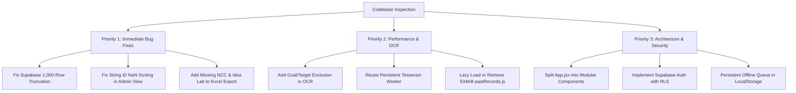

# Comprehensive Codebase Inspection & Audit Report
**Project:** Staff Fit — Faculty Step Count Monitoring System  
**Repository:** `Manju1303/Stepcount`  
**Audit Date:** October 4, 2026  
**Audited Components:** React 19 Frontend, Tesseract.js OCR Pipeline, Supabase Database Client, ExcelJS Export Engine, PWA Service Worker  

---

## 1. Executive Summary & Health Scorecard

A full architectural, security, and algorithmic audit was conducted across the **Staff Fit Step Count Monitoring System**. 

| Category | Health Rating | Status | Summary |
| :--- | :---: | :---: | :--- |
| **Data Integrity & Queries** | 🔴 Critical | **Action Required** | Supabase query silently drops 1,181+ records due to 1,000-row limit; string ID math causes `NaN` sort. |
| **Security & Auth** | 🔴 Critical | **Action Required** | All 141 passwords stored in plain-text client JS; unrestricted Supabase Anon table access. |
| **OCR & Extraction Logic** | 🟡 Moderate | **Improvements Recommended** | "Goal" vs "Actual" step ambiguity; sequential Tesseract worker recreation overhead. |
| **Performance & Bundle** | 🟡 Moderate | **Optimization Needed** | 1.84 MB bundle size caused by inlining 534 KB past records in client bundle; canvas memory spikes. |
| **Architecture & Structure** | 🟡 Moderate | **Refactoring Advised** | Monolithic `App.jsx` (1,450 lines) combining UI, database queries, OCR, and Excel generation. |
| **PWA & Offline Resilience** | 🟢 Good | **Minor Polish** | PWA works with service worker; offline submission sync requires queue persistence. |

---

## 2. Critical Bugs & Runtime Errors (High Severity)

### 🔴 Issue 1: Supabase 1,000-Row Query Truncation Bug
* **Location:** [`src/App.jsx`](file:///d:/Github/stepcount/src/App.jsx#L850-L865)
* **The Problem:** 
  The Supabase query fetching records in `AdminDashboard`:
  ```javascript
  const { data, error } = await supabase
    .from('step_records')
    .select('*')
    .gte('date', cutoffStr);
  ```
  Supabase's underlying PostgREST API enforces a default server limit of **1,000 rows maximum** per query. 
* **Impact:** 
  The database currently contains **2,181 rows**. Supabase returns exactly **1,000 rows**, silently dropping **1,181 records**! This directly distorts:
  - 90-day duplicate checking (historical matches older than the first 1,000 rows are missed).
  - Monitoring reports on earlier dates.
  - Overall college performance statistics.
* **Fix:** 
  Paginate or use `.range(0, 4999)` or query specifically for the active date range:
  ```javascript
  let allFetched = [];
  let from = 0;
  const batchSize = 1000;
  while (true) {
    const { data, error } = await supabase
      .from('step_records')
      .select('*')
      .gte('date', cutoffStr)
      .range(from, from + batchSize - 1);
    if (error || !data || data.length === 0) break;
    allFetched = allFetched.concat(data);
    if (data.length < batchSize) break;
    from += batchSize;
  }
  ```

---

### 🔴 Issue 2: Broken "Recents First" Sorting Caused by String ID Subtraction
* **Location:** [`src/App.jsx`](file:///d:/Github/stepcount/src/App.jsx#L936-L948)
* **The Problem:** 
  In `AdminDashboard`, sorting records by recents executes:
  ```javascript
  const timeA = recA ? recA.id : 0;
  const timeB = recB ? recB.id : 0;
  return timeB - timeA;
  ```
  In `pastRecords.js`, all IDs are formatted as strings (e.g., `"rec-2026-08-30-cse001"`). Subtracting two strings (`"rec-..." - "rec-..."`) evaluates to `NaN`.
* **Impact:** 
  In JavaScript, any sorting comparison returning `NaN` results in undefined, arbitrary ordering. Faculty members are not ordered by recents.
* **Fix:** 
  Sort by upload date and time:
  ```javascript
  const dateA = recA ? new Date(`${recA.date} ${recA.uploaded_time || recA.time || '00:00'}`).getTime() : 0;
  const dateB = recB ? new Date(`${recB.date} ${recB.uploaded_time || recB.time || '00:00'}`).getTime() : 0;
  return dateB - dateA;
  ```

---

### 🔴 Issue 3: Hardcoded Department List in Excel Export Omitting Staff
* **Location:** [`src/App.jsx`](file:///d:/Github/stepcount/src/App.jsx#L273-L277)
* **The Problem:** 
  In `exportToExcelFull`:
  ```javascript
  const depts = ['CSE', 'IT', 'MCA', 'AI&DS', 'Cyber Security', 'Automobile', 'Civil', 'ECE', 'EEE', 'Mech', 'S&H', 'COE', 'Exam Cell', 'Library', 'Placement', 'Admission', 'Office', 'MBA', 'Yoga', 'PD', 'FM Radio'];
  ```
* **Impact:** 
  New departments added to the college—specifically **NCC** (`ncc001`, Mr. Mohammad bilal) and **Idea Lab** (`idealab001`, Mr. Ragu)—are **completely missing** from this array. When the Principal downloads the official Excel report, NCC and Idea Lab faculty members are silently excluded from all department attendance tables!
* **Fix:** 
  Dynamically derive departments from the staff dataset:
  ```javascript
  const depts = [...new Set(mockStaffMembers.filter(s => s.id !== 'principal').map(s => s.dept))];
  ```

---

### 🔴 Issue 4: Offline Fallback Promises Cloud Sync But Never Executes It
* **Location:** [`src/App.jsx`](file:///d:/Github/stepcount/src/App.jsx#L630-L646)
* **The Problem:** 
  When a staff submission fails due to poor connectivity:
  ```javascript
  alert("Submission saved successfully! (Note: Saved locally and will sync to cloud).");
  ```
  The record is only placed into temporary React component state (`setRecords(prev => [localRec, ...prev])`).
* **Impact:** 
  It is **never** written to `localStorage`, and there is no sync queue or service worker background sync. As soon as the user closes or refreshes the page, the submission is completely lost forever while the user believes it was saved.
* **Fix:** 
  Store offline submissions in `localStorage.setItem('pending_sync_records', ...)` and add an `online` window event listener to flush queued records to Supabase once connectivity returns.

---

## 3. Security & Authentication Vulnerabilities

### 🔒 1. Client-Side Authentication & Plain-Text Passwords
* **Files:** [`src/data.js`](file:///d:/Github/stepcount/src/data.js), [`src/App.jsx`](file:///d:/Github/stepcount/src/App.jsx#L484-L500)
* **Risk:** 
  All 141 staff passwords (`jkkmct`) and admin credentials (`admin / admin`) are bundled directly into the minified production JS (`dist/assets/index-*.js`). Any visitor can open Chrome DevTools (Sources / Network), view `mockStaffMembers`, and log in as any teacher or the college Administrator.
* **Recommendation:** 
  Migrate to Supabase Auth (`supabase.auth.signInWithPassword`), or store one-way bcrypt/argon2 password hashes on the backend.

### 🔒 2. Unrestricted Row Level Security (RLS) on Supabase
* **Files:** [`src/supabaseClient.js`](file:///d:/Github/stepcount/src/supabaseClient.js)
* **Risk:** 
  The public Supabase anon key is shipped in the client code without Row Level Security (RLS) policies. Anyone can use the browser console to run `supabase.from('step_records').delete()` or inject arbitrary step numbers into any staff member's account.
* **Recommendation:** 
  Enable RLS on `step_records` table in the Supabase Dashboard:
  ```sql
  ALTER TABLE step_records ENABLE ROW LEVEL SECURITY;
  ```

---

## 4. OCR & Step Count Extraction Edge Cases

### 🔍 1. "Goal" vs "Actual Steps" Ambiguity
* **File:** [`src/extractionLogic.js`](file:///d:/Github/stepcount/src/extractionLogic.js#L138-L230)
* **Symptom:** 
  In fitness apps (e.g. Samsung Health, Google Fit), screens often display:
  `Goal: 10,000 steps` alongside `Today: 4,250 steps`.
* **The Vulnerability:** 
  `extractSteps` assigns both numbers high scores because both are near the keyword `steps`. Line 219 returns `Math.max(...labeledCandidates)`, which picks `10,000` (the target goal) instead of the actual `4,250` steps walked!
* **Recommendation:** 
  Add `GOAL_KEYWORDS = ['goal', 'target', 'aim', 'limit']` and penalize or discard numbers directly following a goal keyword within a 2-token window.

### 🔍 2. Hardcoded Calendar Year Range
* **File:** [`src/extractionLogic.js`](file:///d:/Github/stepcount/src/extractionLogic.js#L74)
* **The Code:** `if (/^(2023|2024|2025|2026)$/.test(t)) continue;`
* **Risk:** 
  Starting January 1, 2027, timestamps showing `2027` will no longer be recognized as years and may be mistaken for step counts.
* **Fix:** 
  Generalize the regex: `if (/^(19\d\d|20\d\d)$/.test(t)) continue;`

---

## 5. Performance & Bundle Optimization

### ⚡ 1. Massive 1.84 MB Bundle Size from Inlined Database Dump
* **File:** [`src/pastRecords.js`](file:///d:/Github/stepcount/src/pastRecords.js) (534 KB raw text)
* **Impact:** 
  The production JS bundle is currently **1,836 KB** (1.84 MB). On 3G or 4G mobile connections on campus, this creates a 3-5 second white screen delay on first load.
* **Root Cause:** 
  All 2,139 past records from August/September 2026 are already populated in the cloud Supabase database, but are still bundled statically into `src/pastRecords.js`.
* **Solution:** 
  Remove `pastRecords.js` from the static bundle or load it dynamically via `import('./pastRecords.js')` only as a network failure fallback.

### ⚡ 2. Redundant Tesseract.js Worker Spawning
* **File:** [`src/App.jsx`](file:///d:/Github/stepcount/src/App.jsx#L134-L162)
* **The Problem:** 
  `processScreenshot` invokes `Tesseract.recognize(...)` up to 3 times in sequential fallback passes (Pass 1 cropped, Pass 2 uncropped, Pass 3 contrast boost). Each call spawns a brand new Web Worker thread, allocates memory, loads language data, and shuts down.
* **Impact:** 
  Image processing takes 6-12 seconds on mobile devices and causes device heating.
* **Fix:** 
  Instantiate a single persistent Tesseract worker:
  ```javascript
  let worker = null;
  const getWorker = async () => {
    if (!worker) {
      worker = await Tesseract.createWorker('eng');
    }
    return worker;
  };
  ```

### ⚡ 3. 2x Canvas Upscaling on High-Resolution Screenshots
* **File:** [`src/App.jsx`](file:///d:/Github/stepcount/src/App.jsx#L53-L65)
* **The Problem:** 
  `canvas.width = cropWidth * 2; canvas.height = cropHeight * 2;`
  Modern smartphones (FHD+/QHD+) take screenshots at 1440x3200. Doubling dimensions creates a 2880x6400 canvas (18.4 million pixels = 73.7 MB of uncompressed RGBA pixel buffers in memory).
* **Impact:** 
  Can trigger Out-Of-Memory (OOM) tab reloads on budget Android smartphones.
* **Fix:** 
  Scale up small images, but cap maximum dimensions at 1600px width/height.

---

## 6. Code Architecture & Maintainability

### 🏗️ 1. Monolithic `App.jsx`
* **Size:** ~1,450 lines of code in a single file.
* **Components Inlined:** `preprocessImage`, `processScreenshot`, `exportToExcelFull`, `exportPendingListExcel`, `Navbar`, `Login`, `StaffDashboard`, `AdminDashboard`, `App`.
* **Recommendation:** Refactor into a standard component folder structure:
  ```
  src/
  ├── components/
  │   ├── Navbar.jsx
  │   ├── Login.jsx
  │   ├── StaffDashboard.jsx
  │   └── AdminDashboard/
  │       ├── DuplicateAlertsPanel.jsx
  │       ├── MonitoringTable.jsx
  │       └── PerformanceGrid.jsx
  ├── services/
  │   ├── ocrService.js
  │   ├── exportService.js
  │   └── syncService.js
  └── utils/
  ```

### 🏗️ 2. Input Whitespace Sensitivity on Login
* **File:** [`src/App.jsx`](file:///d:/Github/stepcount/src/App.jsx#L489)
* **Problem:** `mockStaffMembers.find(s => s.id.toLowerCase() === id.toLowerCase())`
  If a faculty member accidentally pastes their ID with a trailing space (`"cse001 "`), login fails.
* **Fix:** Apply `.trim()` to `id` and `password`.

---

## 7. Actionable Priority Roadmap



---

## 8. Summary Table of Recommended Code Patches

| File | Lines | Issue Description | Proposed Solution |
| :--- | :--- | :--- | :--- |
| `src/App.jsx` | 850–875 | Supabase `.select('*')` capped at 1,000 records | Implement range pagination loop (`range(from, from + 999)`) |
| `src/App.jsx` | 936–948 | Recents sort subtraction with string ID results in `NaN` | Sort by parsed date-time objects instead of ID subtraction |
| `src/App.jsx` | 273–275 | Excel export omits "NCC" and "Idea Lab" faculty | Derive departments dynamically from `mockStaffMembers` |
| `src/App.jsx` | 489 | Login rejects IDs with trailing whitespace | Add `.trim()` to `id` and `password` on form submission |
| `src/extractionLogic.js` | 74 | Hardcoded year list expires in 2027 | Replace with generic `/(19\d\d\|20\d\d)/` regex |
| `src/extractionLogic.js` | 138–205 | Step target/goal numbers mistakenly extracted as actual steps | Add `goal` and `target` keyword suppression to OCR scoring |
| `src/App.jsx` | 134–165 | Up to 3 Tesseract worker initializations per screenshot | Use single persistent worker via `Tesseract.createWorker()` |
| `src/pastRecords.js` | 1–23533 | 534 KB database dump bundled into initial client JS bundle | Remove or dynamically load only when Supabase is unreachable |
