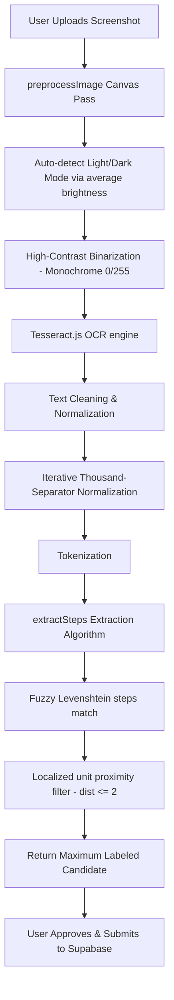

# Staff Fit — Step Count Monitoring System

A premium, glassmorphic React web application designed for the **Faculty Welfare Club of JKK Muniraja College of Technology** to track, monitor, and report daily staff step counts. The system uses client-side OCR (Optical Character Recognition) to automatically extract step counts from fitness app screenshots (Google Fit, Fitbit, Apple Watch, etc.) and logs them to a centralized Supabase database.

---

## 🚀 Key Features

*   **Secure Authentication**: Role-based access control for **Staff** (to submit screenshots and view their monthly history) and **Admin** (to view global namelists, department performance, and export attendance sheets).
*   **Automated OCR Screenshot Extraction**: Upload a fitness screenshot and have the system instantly extract the step count, eliminating manual entry errors.
*   **Adaptive Image Binarization**: Automatically detects the color theme of the screenshot (light vs. dark theme) and applies high-contrast binarization. This makes even low-contrast green or blue text inside circular rings highly legible to the OCR engine.
*   **Fuzzy Keyword Matching**: Employs Levenshtein edit distance algorithms (distance $\le 2$) to match spelling typos from the OCR output (e.g. `stcps`, `sreps`, `stps` -> `steps`).
*   **Multi-Column Grid Proximity Isolation**: Restricts unit keyword detection (like `Cal`, `mi`, `min`) to a maximum distance of 2 tokens. This prevents column layout crosstalk (e.g. mistaking a nearby calorie count for the step count).
*   **Thousand-Separator Normalizer**: Automatically cleans and parses spacing, period, and comma thousand-separated numbers (e.g., `5.117`, `10 537`, `124,560`).
*   **Excel Export**: Generates professional, print-ready A4 reports grouped by department with automatically calculated summaries, absent/present flags, and principal signature lines.

---

## 🛠️ Tech Stack

*   **Frontend Framework**: React 19 (via Vite)
*   **Styling & Motion**: Vanilla CSS & Framer Motion (for smooth glassmorphism transitions)
*   **Icons**: Lucide React
*   **OCR Engine**: Tesseract.js (v7.0.0)
*   **Excel Generation**: ExcelJS & FileSaver
*   **Database & Backend**: Supabase (PostgreSQL)
*   **Test Suite**: Vitest

---

## 📐 System Architecture & Flow



### 1. Preprocessing Pipeline (`App.jsx`)
Standard screenshots often have colored text on white or black backgrounds.
*   The system loads the image onto a `canvas` and scales it up **2x** to increase character size.
*   It computes the average brightness of the image:
    *   **Light Theme**: Any pixel brightness $< 200$ (representing text) is converted to pure black (`0`), and background to pure white (`255`).
    *   **Dark Theme**: Any pixel brightness $> 55$ is converted to pure white (`255`), and background to pure black (`0`).
*   This removes shadows, gradients, and anti-aliasing artifacts, yielding a binary high-contrast image.

### 2. Tokenization and Normalization (`extractionLogic.js`)
*   Commas are stripped.
*   An iterative regular expression `/\b(\d{1,3})\s*[.,\s]\s*(\d{3})\b/g` removes period or space thousand-separators (converting `5.117` or `5 117` into `5117`).
*   The clean text is split into a token array, omitting non-matching date timestamps (e.g., `2026`).

### 3. Step Count Extraction heuristic
*   For each integer token, the system looks at a surrounding window of `[-5, 5]` tokens.
*   **Unit Detection**: Checks for units (`cal`, `mi`, `km`, `min`, `bpm`). To prevent columns from overlapping, units are only registered if they are within **2 tokens** of the number.
*   **Steps Labeling**: Checks if any neighboring token matches the `steps` keyword using fuzzy edit-distance metrics.
*   **Scoring**: If a steps label is found, the candidate gets a score from `6` to `10` based on closeness. If it's a known unit value, its score is set to `0`.
*   **Resolution**: Returns the maximum value of all candidates that scored $\ge 5$.

---

## ⚙️ Setup and Installation

### Prerequisites
*   Node.js (v18+)
*   NPM

### Installation
1. Clone the repository and navigate to the project directory.
2. Install dependencies:
    ```bash
    npm install
    ```
3. Create a `.env` file in the root directory (or configure Vercel environment variables) with your Supabase credentials:
    ```env
    VITE_SUPABASE_URL=your_supabase_url
    VITE_SUPABASE_ANON_KEY=your_supabase_anon_key
    ```
4. Run the development server:
    ```bash
    npm run dev
    ```

### Running Tests
To run the automated extraction logic unit tests:
```bash
npm test
```
