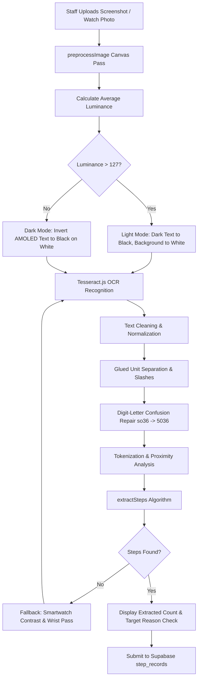

# Staff Fit — Step Count Monitoring System

A high-performance, glassmorphic React web application developed for the **Faculty Welfare Club of JKK Muniraja College of Technology** to track, monitor, and report daily staff fitness activity. The platform uses client-side OCR (Optical Character Recognition) to automatically extract step counts from fitness screenshots and smartwatch photos, and synchronizes with a cloud database and Excel reporting system.

Deployed on **Vercel** with a centralized **Supabase (PostgreSQL)** backend.

---

## 🚀 Key Features

*   **Role-Based Authentication**:
    *   **Staff Portal**: Secure login for **141 registered staff members** across all academic and administrative departments. Staff can submit fitness screenshots, view extracted counts, enter reasons for counts $< 5000$, and track personal historical attendance.
    *   **Admin Dashboard**: Master administrative monitoring console (`admin` / `admin`) providing date-wise namelists, department filtering, sorting (Recents, High-to-Low, Low-to-High), top/bottom performers, and automated duplicate alerts.
*   **High-Accuracy OCR Pipeline**:
    *   **Multi-Pass Adaptive Preprocessing**:
        *   *Pass 1 (Light Theme)*: Auto-detects light backgrounds and applies black-on-white binarization ($< 190$ brightness threshold).
        *   *Pass 2 (Smartwatch & Dark Theme)*: Automatically inverts dark AMOLED/smartwatch displays ($> 65$ brightness) into clean black text on white background, addressing Tesseract's character segmentation limitations on dark screens.
        *   *Pass 3 (Wrist Photo Contrast Boost)*: Real camera photos of smartwatch displays on staff wrists are enhanced using a 1.6x contrast-stretched grayscale filter.
    *   **OCR Character & Digit Repair**: Resolves common optical letter-digit confusions in numeric tokens adjacent to step markers (e.g. `so36` $\rightarrow$ `5036`, `5o31` $\rightarrow$ `5031`, `8i3i` $\rightarrow$ `8131`).
    *   **Glued Unit & Symbol Parser**: Separates tokens joined without spaces (e.g., `5036steps` $\rightarrow$ `5036 steps`, `steps:5036` $\rightarrow$ `steps 5036`).
    *   **Goal Ratio Filtering**: Parses smartwatch goal ratios (e.g., `3500 / 10000`) and prioritizes the current completed count over the daily target.
    *   **Fuzzy Levenshtein Keyword Matching**: Employs edit-distance matching with expanded vocabulary (`steps`, `step`, `staps`, `stes`, `stps`, `slps`, `sleps`, `siers`, `sreps`, `stecs`, `steos`, `stept`, `stepcount`).
    *   **Column Layout Proximity Filtering**: Bounds unit detection (`Cal`, `mi`, `km`, `min`, `bpm`) to $\le 2$ tokens to prevent multi-column crosstalk.
*   **90-Day Duplicate Step Count Detection**:
    *   Automatically flags duplicate step counts submitted by the same staff member or across different staff members within a 90-day window.
    *   Displays admin audit alerts with first and last upload timestamps and day differences.
*   **Comprehensive Excel Reporting**:
    *   **Department Attendance Sheet**: Formatted print-ready A4 report grouped by department with S.NO, Name & Designation, Steps, Timing, and Remarks.
    *   **Dedicated Pending List Worksheet**: Built-in tab listing non-submitting staff for the day.
    *   **1-Click Pending List Export**: Dedicated button to download `Pending_Staff_Report_{date}.xlsx` for instant defaulter follow-up.
    *   **Pre-Generated 20-Day Defaulter Report**: `Staff_Step_Count_Pending_and_Defaulter_Report.xlsx` tracking all pending instances and staff compliance rankings.
*   **Historical Records & Offline Resilience**:
    *   Pre-seeded with **2,139 past attendance records** spanning August 30 to September 18, 2026.
    *   Synchronized live to Supabase (`step_records` table) with built-in client fallback.

---

## 🛠️ Tech Stack

*   **Frontend**: React 19, Vite
*   **Styling & Motion**: Vanilla CSS, Glassmorphic UI Tokens, Framer Motion
*   **Icons**: Lucide React
*   **OCR Engine**: Tesseract.js (v7.0.0)
*   **Excel Engine**: ExcelJS, FileSaver
*   **Cloud Database**: Supabase (PostgreSQL)
*   **Deployment**: Vercel
*   **Test Suite**: Vitest (100% pass rate across 23 unit tests)

---

## 📐 System Architecture


```mermaid
graph TD
    A[Staff Uploads Screenshot / Watch Photo] --> B[preprocessImage Canvas Pass]
    B --> B1[Calculate Average Luminance]
    B1 --> B2{Luminance > 127?}
    B2 -- Yes --> B3[Light Mode: Dark Text to Black, Background to White]
    B2 -- No --> B4[Dark Mode: Invert AMOLED Text to Black on White]
    B3 --> C[Tesseract.js OCR Recognition]
    B4 --> C
    C --> D[Text Cleaning & Normalization]
    D --> D1[Glued Unit Separation & Slashes]
    D1 --> D2[Digit-Letter Confusion Repair so36 -> 5036]
    D2 --> E[Tokenization & Proximity Analysis]
    E --> F[extractSteps Algorithm]
    F --> G{Steps Found?}
    G -- No --> H[Fallback: Smartwatch Contrast & Wrist Pass]
    H --> C
    G -- Yes --> I[Display Extracted Count & Target Reason Check]
    I --> J[Submit to Supabase step_records]
```

---

## 👥 Staff Credentials

All **141 staff members** are configured in [`src/data.js`](src/data.js).

| Role | Identifier | Password | Access Level |
| :--- | :--- | :--- | :--- |
| **Admin** | `admin` | `admin` | Full Monitoring Dashboard, Date Selector, Excel Exports |
| **Principal** | `principal` | `jkkmct` | Staff Portal Submission & History |
| **CSE Department** | `cse001` – `cse010` | `jkkmct` | Staff Portal Submission & History |
| **IT Department** | `it001` – `it005` | `jkkmct` | Staff Portal Submission & History |
| **MCA Department** | `mca001` – `mca004` | `jkkmct` | Staff Portal Submission & History |
| **AI & DS Department** | `ad001` – `ad007` | `jkkmct` | Staff Portal Submission & History |
| **Cyber Security** | `cs001` – `cs005` | `jkkmct` | Staff Portal Submission & History |
| **Automobile Department** | `auto001` – `auto005` | `jkkmct` | Staff Portal Submission & History |
| **Civil Department** | `civil001` – `civil005` | `jkkmct` | Staff Portal Submission & History |
| **ECE Department** | `ece001` – `ece010`, `lab001` | `jkkmct` | Staff Portal Submission & History |
| **EEE Department** | `eee001` – `eee007`, `lab002` | `jkkmct` | Staff Portal Submission & History |
| **Mechanical Department** | `mech001` – `mech007` | `jkkmct` | Staff Portal Submission & History |
| **S&H Department** | `s&h001` – `s&h025` | `jkkmct` | Staff Portal Submission & History |
| **COE & Exam Cell** | `coe001` – `coe006`, `ec001` – `ec005` | `jkkmct` | Staff Portal Submission & History |
| **Library, Placement & Admission** | `lib001` – `lib002`, `pc001` – `pc004`, `ac001` – `ac002` | `jkkmct` | Staff Portal Submission & History |
| **Administrative Office & Mess** | `office001` – `office012`, `staff001` | `jkkmct` | Staff Portal Submission & History |
| **MBA, Yoga, PD, NCC, Idea Lab** | `mba001` – `mba003`, `yoga001`, `pd001` – `pd004`, `ncc001`, `idealab001`, `fm001` | `jkkmct` | Staff Portal Submission & History |

---

## 📊 Database Schema (`step_records`)

```sql
CREATE TABLE step_records (
  id BIGSERIAL PRIMARY KEY,
  created_at TIMESTAMPTZ DEFAULT NOW(),
  staff_id TEXT NOT NULL,
  name TEXT,
  dept TEXT,
  steps INTEGER NOT NULL,
  date TEXT NOT NULL,
  time TEXT,
  uploaded_time TEXT,
  reason TEXT
);
```

*Database backups are preserved in `step_records_seed.json` and `step_records_seed.sql`.*

---

## 💻 Local Development & Deployment

### Prerequisites
*   Node.js (v18+)
*   NPM

### Setup
1. Clone the repository:
   ```bash
   git clone https://github.com/Manju1303/Stepcount.git
   cd Stepcount
   ```
2. Install dependencies:
   ```bash
   npm install
   ```
3. Configure environment variables in `.env` (optional, defaults provided):
   ```env
   VITE_SUPABASE_URL=https://ngtbuuuqbnfumonkitqh.supabase.co
   VITE_SUPABASE_ANON_KEY=your_supabase_anon_key
   ```
4. Run locally:
   ```bash
   npm run dev
   ```

### Running Automated Tests
```bash
npm test
```

### Production Build
```bash
npm run build
```

*Continuous Deployment: Pushing commits to the `main` branch on GitHub triggers an automatic deployment build on **Vercel**.*
